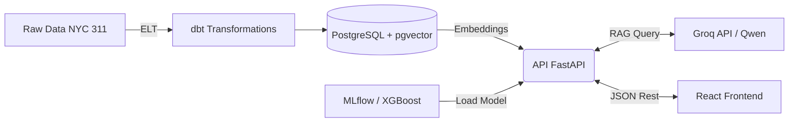

<div align="center">
  
  <h1>🏙️ CityOps AI</h1>
  <p><b>Painel Preditivo e Analítico para Gestão de Chamados Públicos (NYC 311)</b></p>
</div>

<br>

<div align="center">
  
  
  
  
  
  
  
  
</div>

<br>

## 📌 O Desafio (Business Value)
O número de chamados 311 (ruído, lixo, buracos) em metrópoles como Nova York é massivo. O não cumprimento de prazos (Quebra de SLA) acarreta em multas, prejuízos milionários e insatisfação pública. O **CityOps AI** é um centro de comando End-to-End criado para combater este problema de forma inteligente, usando IA para triagem preditiva e inteligência analítica baseada em contexto real.

---

## 🚀 Soluções Integradas

### 1. Predição de Risco de SLA (Machine Learning)
Desenvolvemos um modelo matemático em **XGBoost** capaz de prever se um chamado irá atrasar *antes mesmo da equipe ser despachada*.
- **Feature Engineering:** Variáveis categóricas (Distrito, Agência, Reclamação) transformadas via *One-Hot Encoding*.
- **MLOps:** Versionamento do modelo via **MLflow**, garantindo total reprodutibilidade.
- **Explainable AI (XAI):** Integração com **SHAP**, permitindo a gestores entenderem visualmente *quais fatores* causaram a decisão da IA.

### 2. Analista Autônomo com RAG (Generative AI)
Gestores públicos nem sempre dominam linguagem SQL. Para isso, o sistema possui um **Analista Inteligente**.
- Arquitetura **RAG (Retrieval-Augmented Generation)**.
- Transforma chamados históricos em embeddings (`sentence-transformers`) e armazena em um banco Vetorial (**pgvector** no PostgreSQL).
- As buscas alimentam o moderníssimo LLM **Qwen 2.5** (via Groq API), que elabora relatórios gerenciais sem alucinar, respondendo *apenas* com base em dados.

### 3. Dashboard Cinematográfico
O Frontend em **React + Vite** adota a arquitetura *Bento Grid* (Single-Screen). Toda a orquestração física de tela e entrada visual é manipulada pelo motor **GSAP**, fornecendo estética e leveza exigidas por plataformas corporativas de elite.

---

## ⚙️ Arquitetura de Software



---

## 🛠️ Como Executar Localmente

### Pré-requisitos
- Python 3.9+
- Node.js 18+
- PostgreSQL rodando localmente (na porta 5432)

### 1. Backend (Python + FastAPI)
Clone o repositório, ative o ambiente virtual e instale as dependências:
```bash
git clone https://github.com/Guilherme-Mazzoni/cityops-ai.git
cd cityops-ai
python -m venv venv
.\venv\Scripts\activate  # Windows
pip install -r requirements.txt
```

Inicie o servidor localmente (disponível na porta 8000):
```bash
python -m uvicorn api.main:app --port 8000
```

### 2. Frontend (React + Vite)
Abra um novo terminal e rode o painel:
```bash
cd frontend
npm install
npm run dev
```
Acesse no seu navegador: `http://localhost:5173`

---
*Feito com foco extremo em engenharia de dados, inteligência artificial escalável e experiência do usuário (UX).*